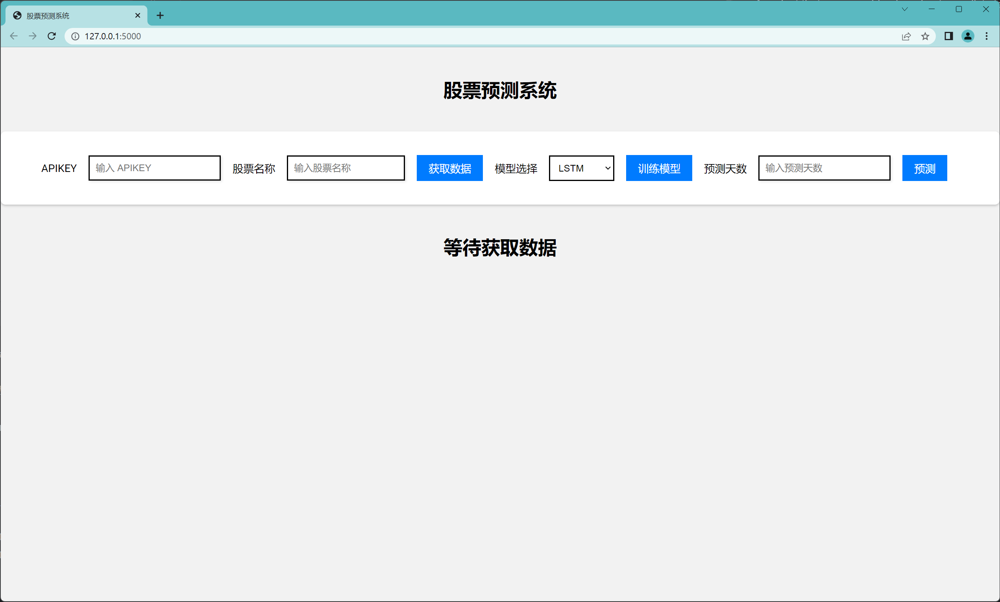
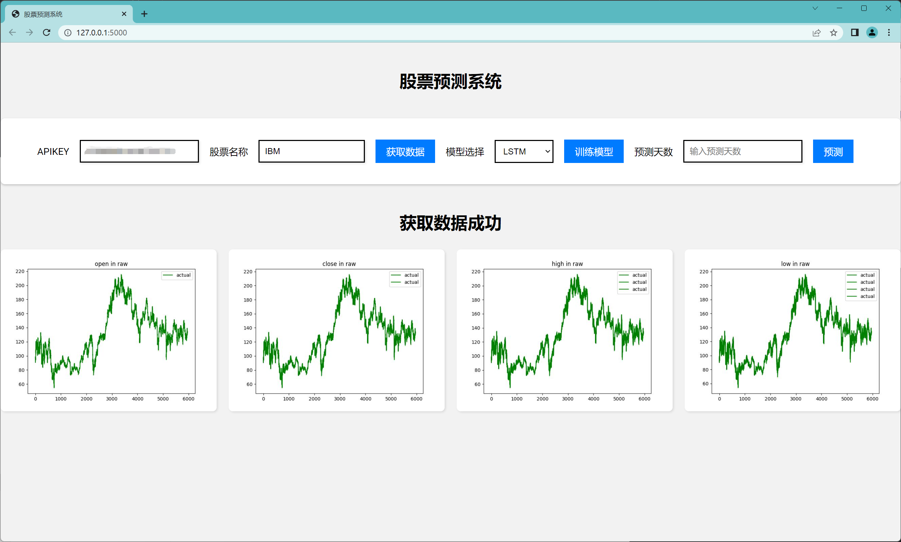
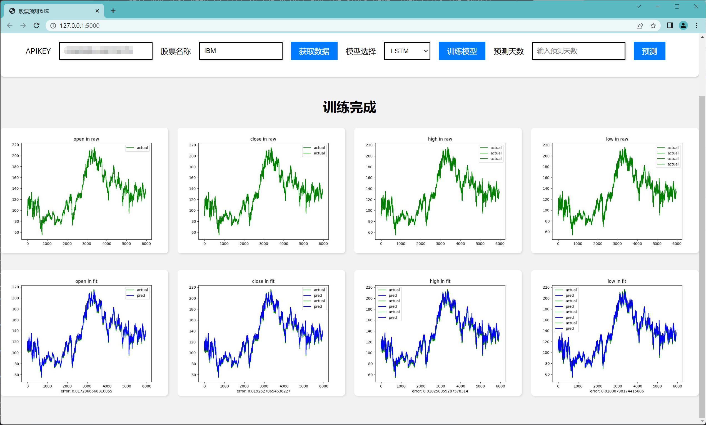
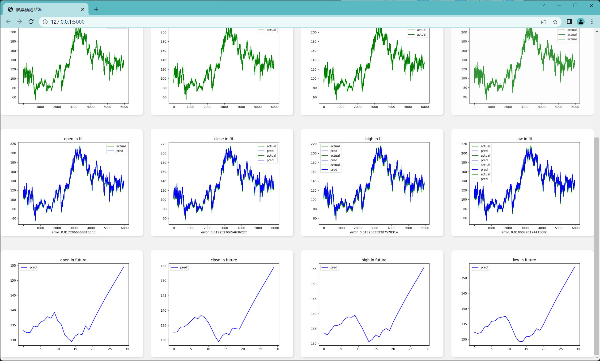

# StockPrediction

A project that uses LSTM and XGBoost to predict stock prices

## Table of Contents

- [Install](#install)
- [Usage](#usage)
- [License](#license)

## Install

```shell
$ pip install -r requirements.txt
```

## Usage

```shell
$ python web.py
```

Then open your browser and visit [http://127.0.0.1:5000](http://127.0.0.1:5000)

You can watch the home page like below



You can apply for a new APIKEY from [alphavanage](https://www.alphavantage.co/support/#api-key)

Next you just need to fill in the APIKEY and the stock name, then click the submit button



You can choose the model you want to use, and then click the submit button



It will show you the result of the model you choose

You can also try to predict future stock prices, but frankly, it's not accurate



The images that are the result are stored in [static/images](./static/images)

The models are stored in [static/models](./static/models)

You can train your models with [train_lstm.py](./train_lstm.py) and [train_xgboost.py](./train_xgboost.py)


## License

GPL-3.0 © [RoiexLee](http://roiexlee.github.io)
